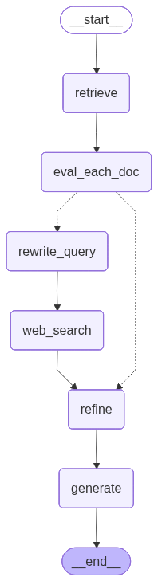

# 🧠 CRAG Assistant

> Corrective RAG over your own PDFs — auto-falls back to web search when local docs aren't enough. Built with LangGraph, Groq, ChromaDB, and Streamlit.


A **Corrective RAG (CRAG)** question-answering system built on top of your own PDF documents. It uses a LangGraph pipeline to decide — per query — whether to answer from your local knowledge base, fall back to the web, or blend both. Everything is tracked end-to-end via LangSmith, and served through a clean Streamlit chat interface with persistent conversation history.

---

## What is CRAG?

Standard RAG retrieves chunks and passes them straight to the LLM regardless of quality. CRAG adds a **correction step**: it scores the retrieved chunks first, and if they aren't good enough, it automatically rewrites the query and searches the web before generating an answer.

This means you get accurate answers even when your documents don't cover the topic — without ever having to manually decide when to search the web.

---

## How the Pipeline Works



The pipeline is a LangGraph state machine with six nodes:

| Step | Node | What it does |
|------|------|--------------|
| 1 | `retrieve` | Pulls the top-4 most similar chunks from ChromaDB using cosine similarity |
| 2 | `eval_each_doc` | Scores each chunk 0–1 for relevance and assigns a verdict |
| 3 | `rewrite_query` | *(only if needed)* Rewrites the question into a tight web search query |
| 4 | `web_search` | *(only if needed)* Runs the rewritten query through Tavily |
| 5 | `refine` | Breaks all candidate text into sentences, keeps only the ones that matter |
| 6 | `generate` | Produces the final answer from the cleaned context |

### Verdict logic

After `eval_each_doc`, the pipeline branches based on how good the local docs are:

- **CORRECT** — at least one chunk scores above `0.7` → skip web, go straight to `refine`
- **INCORRECT** — all chunks score below `0.3` → go to `rewrite_query` → `web_search` → `refine`
- **AMBIGUOUS** — somewhere in between → go to `rewrite_query` → `web_search` → `refine` with both local + web docs merged

---

## Project Structure

```
.
├── crag_code.py        # LangGraph pipeline (retrieval, scoring, refine, generate)
├── app.py              # Streamlit UI with chat history
├── documents/          # Put your PDFs here
│   ├── book1.pdf
│   ├── book2.pdf
│   └── book3.pdf
├── chroma_db/          # Auto-created on first run — vector store lives here
├── chat_history.db     # SQLite file — auto-created on first run
└── requirements.txt
```

---

## Setup

### 1. Clone and install dependencies

```bash
git clone https://github.com/manozpdel/Corrective-RAG.git
cd Corrective-RAG
pip install -r requirements.txt
```

The `requirements.txt` includes everything you need — LangChain, LangGraph, ChromaDB, Groq, HuggingFace, Tavily, and Streamlit. All versions are pinned so the stack is fully compatible out of the box.

> **Note:** `faiss-cpu` is not used in this project — the vector store is ChromaDB, which persists to disk automatically and doesn't require a rebuild on every restart.

### 2. Add your documents

Drop your PDF files into the `documents/` folder and name them `book1.pdf`, `book2.pdf`, `book3.pdf`. If you have more or fewer books, just update the loader section in `crag_code.py`.

### 3. Configure your environment

Create a `.env` file in the root of the project with the following keys:

```dotenv
# Embeddings — used to encode your PDF chunks
HUGGINGFACEHUB_API_TOKEN=your_hf_token

# Web search fallback
TAVILY_API_KEY=your_tavily_key

# LLM for scoring, filtering, and generation
GROQ_API_KEY=your_groq_key

# LangSmith tracing (optional but recommended)
LANGCHAIN_TRACING_V2=true
LANGCHAIN_ENDPOINT=https://api.smith.langchain.com
LANGCHAIN_API_KEY=your_langsmith_key
LANGCHAIN_PROJECT=CRAG
```

You can get free API keys from:
- [HuggingFace](https://huggingface.co/settings/tokens)
- [Tavily](https://app.tavily.com)
- [Groq](https://console.groq.com)
- [LangSmith](https://smith.langchain.com)

### 4. Launch the app

```bash
streamlit run app.py
```

Streamlit will open the app in your browser automatically. On **first launch**, the pipeline reads your PDFs, chunks them, embeds them, and saves everything to `./chroma_db`. This takes a minute or two depending on document size — you'll see progress logs in your terminal. After that, it loads instantly from disk on every subsequent run.

---

## Features

### Chat UI (`app.py`)
- Clean Streamlit chat interface with a persistent sidebar showing all past conversations
- Each conversation is stored in a local SQLite database (`chat_history.db`)
- Conversations are auto-titled from the first message
- Delete individual conversations from the sidebar with the 🗑 button
- **Sources panel** — click "▼ Sources" under any answer to see exactly which documents or web pages were used, along with the verdict and web query that was generated

### Pipeline (`crag_code.py`)
- **Garbage chunk detection** — skips table-of-contents pages, index sections, and other low-quality chunks before they reach the LLM
- **Sanitization** — strips angle-bracket patterns and collapses whitespace to prevent Groq's structured output parser from breaking
- **Sentence-level filtering** — the `refine` node scores individual sentences, not just whole chunks, so only the most relevant content reaches the final prompt
- **Structured outputs** — scoring, filtering, and query rewriting all use Pydantic models with Groq's structured output for reliable parsing

### LangSmith Tracing
Setting `LANGCHAIN_TRACING_V2=true` in your `.env` automatically traces every pipeline run to your LangSmith project. You can see the full execution trace — every LLM call, its inputs/outputs, latency, and token usage — at [smith.langchain.com](https://smith.langchain.com) under the project name `CRAG`.

This is useful for debugging why a particular query got routed to web search, or why a specific chunk was scored low.

---

## Tech Stack

| Component | Tool |
|-----------|------|
| LLM | Llama 3.1 8B via [Groq](https://groq.com) |
| Embeddings | `sentence-transformers/all-mpnet-base-v2` via HuggingFace |
| Vector store | [ChromaDB](https://www.trychroma.com) (local, persisted to disk) |
| Web search | [Tavily](https://tavily.com) |
| Orchestration | [LangGraph](https://langchain-ai.github.io/langgraph/) |
| Tracing | [LangSmith](https://smith.langchain.com) |
| UI | [Streamlit](https://streamlit.io) |
| DB | SQLite (via Python's built-in `sqlite3`) |

---

## Configuration & Tuning

A few values in `crag_code.py` are worth knowing about if you want to tune behavior:

| Variable | Default | What it controls |
|----------|---------|-----------------|
| `UPPER_TH` | `0.7` | Score above which a chunk is considered good enough to answer from |
| `LOWER_TH` | `0.3` | Score below which a chunk is considered useless |
| `chunk_size` | `900` | Characters per chunk when splitting PDFs |
| `chunk_overlap` | `150` | Overlap between consecutive chunks |
| `k` (retriever) | `4` | Number of chunks fetched from ChromaDB per query |
| `max_results` (Tavily) | `5` | Number of web results fetched |

If your documents are dense and technical, raising `UPPER_TH` slightly (e.g. to `0.75`) makes the system more conservative about claiming it can answer locally, which leads to more web augmentation.

---

## Running the Pipeline Directly

You can test the pipeline without the UI by running `crag_code.py` directly:

```bash
python crag_code.py
```

This runs a sample query (`"Batch normalization vs layer normalization"`) and prints the verdict, reason, web query used (if any), and the final answer.

---

## Dependencies Overview

All dependencies are in `requirements.txt` with pinned versions. Key things to know:

- **ChromaDB** is used as the vector store (not FAISS). It persists to disk automatically under `./chroma_db/` so the index survives restarts without a rebuild.
- **`python-dotenv`** is the correct package for loading `.env` files — make sure you don't accidentally install the unrelated `dotenv` package.
- **Streamlit** is included and pinned at `>=1.35.0`. Launch the app with `streamlit run app.py` from the project root.
- All LangChain packages (`langchain`, `langchain-core`, `langchain-community`, etc.) are pinned to compatible versions — avoid upgrading them individually as version mismatches between these packages cause subtle, hard-to-debug errors.

---

## Notes

- The ChromaDB index is built once and reused on every subsequent run. If you add new PDFs or want to re-chunk with different settings, just delete the `chroma_db/` folder and run `streamlit run app.py` again to rebuild it.
- The app uses one SQLite connection per operation — simple and safe for a single-user local setup, but not suitable for multi-user production deployment without connection pooling.
- LangSmith tracing adds a small amount of latency per run (usually under 100ms) since it sends trace data asynchronously in the background. You can disable it by removing `LANGCHAIN_TRACING_V2` from your `.env`.
